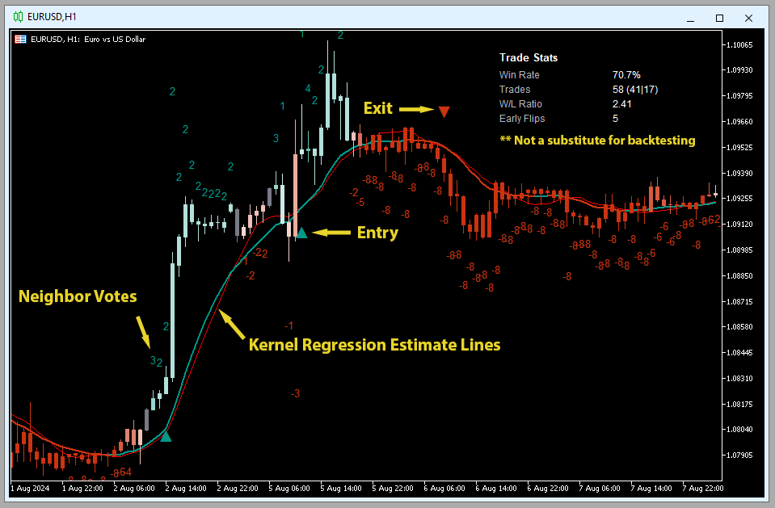
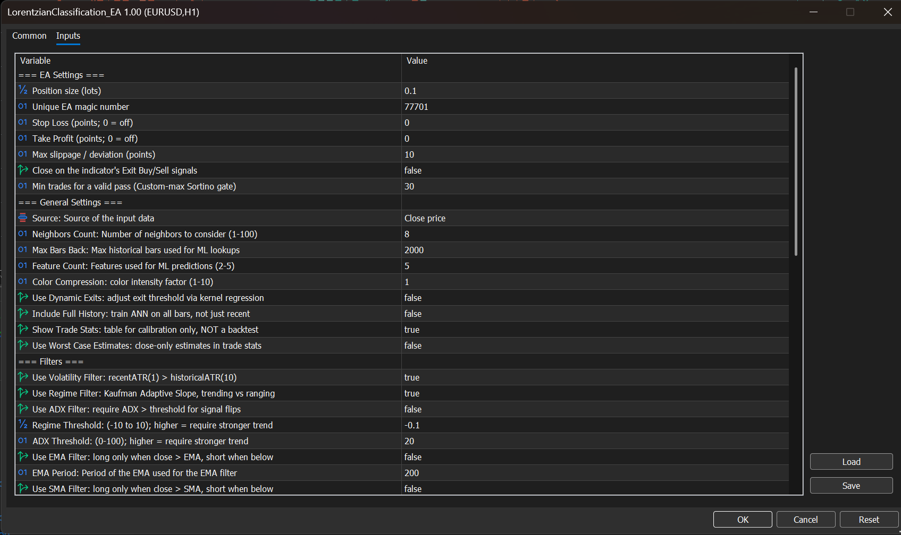
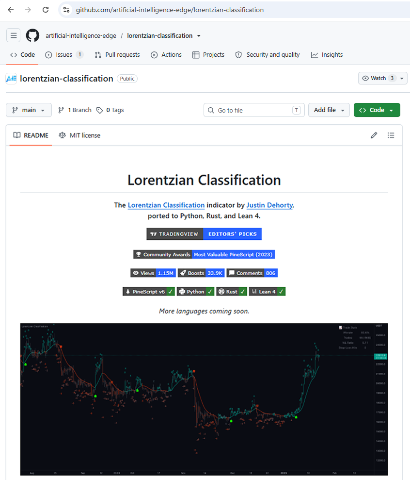

<div align="center">


# Lorentzian Classification — MetaTrader 5 Port

**The official MetaTrader 5 / MQL5 port of [jdehorty](https://github.com/jdehorty)'s Lorentzian
Classification indicator — a complete, one-to-one parity port of the TradingView original, plus a
companion Expert Advisor for trading and backtesting.**

<p>
  
  
  
  
</p>

</div>

This port brings Lorentzian Classification to the MetaTrader 5 ecosystem. It ships **two pieces**,
both open source and MIT licensed:

- ✅ **`LorentzianClassification`** — the indicator: a faithful, one-to-one port of the
  TradingView original.
- ✅ **`LorentzianClassification_EA`** — a thin Expert Advisor that trades and backtests the
  indicator's signals inside MetaTrader 5.

## Parity — the whole point

This is a one-to-one port of the PineScript v6 reference: **same parameters, same names, same
defaults, the same math under the hood.** Because the behavior is identical top-to-bottom, there
is **nothing new to learn** — every input maps to the TradingView control of the same name, and
parity runs in both directions:

> Tune the indicator on TradingView and the exact settings carry straight into MetaTrader 5.
> Discover something in MetaTrader 5 — using its far deeper backtesting and optimization tools —
> and take it straight back to TradingView. Your work carries across both ecosystems and you
> don't lose a thing.

Reaching that parity leaned on what MQL5 does well. Rather than conforming Pine to Pine, parity
was driven from MetaTrader 5's ability to import **synthetic data** — including a Brownian-bridge
tick simulation — to exercise the algorithm far more deeply than replaying historical bars
allows. That depth paid off beyond the port itself: it surfaced long-standing, very minor bugs in
the original Lorentzian Classification algorithm, and the fixes directly produced the
**PineScript v6 release** of the original TradingView indicator.

## The Indicator

Drop `LorentzianClassification` onto a chart from the Navigator and it plots exactly like the
TradingView version — bar coloring, the kernel-regression estimate lines, and bullish/bearish
signal labels — with a real-time **Trade Stats** table in the corner.

<div align="center">



<sub><i>The port on EURUSD, H1 — bar-prediction "neighbor votes", kernel-regression estimate
lines, and entry/exit markers, with the in-chart Trade Stats table.</i></sub>

</div>

| On the chart | What it is |
| --- | --- |
| **Neighbor votes** | The integer beside each bar — the net vote of its nearest historical analogs. Larger magnitude ⇒ stronger directional conviction. |
| **Kernel regression estimate lines** | The smoothed rational-quadratic kernel estimate of price; crossovers drive optional smoothing and trend color. |
| **Entry** ▲ / **Exit** ▼ | Bullish and bearish signal markers, plotted where the classifier flips. |
| **Bar colors** | Colored by prediction strength; Color Compression controls intensity. |

> [!IMPORTANT]
> **The Trade Stats table is a calibration tool, not a backtest.** It gives quick real-time
> feedback (Win Rate, Trades, W/L Ratio, Early Flips) while you tune features — *"not a
> substitute for backtesting."* For real backtests, use the Strategy Tester with the EA below.

<details>
<summary><b>Settings reference</b> (one-to-one with TradingView — click to expand)</summary>

Defaults are tuned for the 4H–12H timeframes but work reasonably across others.

### General

| Setting | Default | Description |
| --- | --- | --- |
| **Source** | Close | Input data source for the classifier. |
| **Neighbors Count** | 8 | Number of nearest historical analogs to poll (1–100). |
| **Max Bars Back** | 2000 | Maximum number of historical bars used for lookups. |
| **Feature Count** | 5 | Number of features used for predictions (2–5). |
| **Color Compression** | 1 | Compression factor for the color-scale intensity (1–10). |
| **Show Exits** | ✗ | Show exit-arrow markers on the chart. |
| **Use Dynamic Exits** | ✗ | Extend the exit threshold using kernel regression to reduce premature exits. |
| **Include Full History** | ✗ | Train on the full bar history; when off, use only the most recent *Max Bars Back* bars. |
| **Show Trade Stats** | ✓ | Display the Trade Stats table (calibration only — not a backtest). |
| **Use Worst Case Estimate** | ✗ | Use bar close instead of mid-bar price for Trade Stats — a more conservative estimate. |

### Feature Engineering

Each feature accepts **Parameter A** and **Parameter B**; their meaning depends on the selected
indicator. The same indicator used with different parameters counts as two separate features.

| Feature | Parameter A | Parameter B |
| --- | --- | --- |
| **RSI** | RSI period | EMA smoothing period applied to the RSI |
| **WT** (WaveTrend) | Channel length | Average length (second-stage smoothing) |
| **CCI** | CCI period | EMA smoothing period applied to the CCI |
| **ADX** | ADX period | *Not used — ADX ignores it* |

Defaults: `RSI(14,1)` · `WT(10,11)` · `CCI(20,1)` · `ADX(20,2)` *(B unused)* · `RSI(9,1)`.

### Filters

| Setting | Default | Description |
| --- | --- | --- |
| **Use Volatility Filter** | ✓ | Require recent ATR > historical ATR. |
| **Use Regime Filter** | ✓ | Kaufman-Adaptive-Slope trend-vs-ranging detection. |
| **Use ADX Filter** | ✗ | Require ADX above threshold for signal flips. |
| **Regime Threshold** | -0.1 | Trend/range cutoff (-10 to 10); higher ⇒ stronger trend required. |
| **ADX Threshold** | 20 | ADX cutoff (0–100); higher ⇒ stronger trend required. |
| **Use EMA Filter** | ✗ | Longs require close above the EMA; shorts require close below. |
| **EMA Period** | 200 | Period of the EMA filter. |
| **Use SMA Filter** | ✗ | Longs require close above the SMA; shorts require close below. |
| **SMA Period** | 200 | Period of the SMA filter. |

### Kernel Regression

| Setting | Default | Description |
| --- | --- | --- |
| **Trade with Kernel** | ✓ | Gate signals on the kernel-regression trend. |
| **Show Kernel Estimate** | ✓ | Draw the kernel estimate line on the chart. |
| **Use Kernel Smoothing** | ✗ | Crossover-based smoothing: fewer color flips, more ML entries. |
| **Lookback Window** | 8 | Bars used for estimation (min 3; recommended 3–50). |
| **Relative Weighting** | 8 | Relative weighting of timeframes (recommended 0.25–25). |
| **Start Regression at Bar** | 25 | Bar index where regression begins (recommended 2–25). |
| **Kernel Lag** | 2 | Lag for crossover detection; lower ⇒ earlier crossovers (recommended 1–2). |

### Display

| Setting | Default | Description |
| --- | --- | --- |
| **Show Bar Colors** | ✓ | Color bars by prediction. |
| **Show Bar Prediction Values** | ✓ | Print the model's per-bar evaluation as an integer. |
| **Use ATR Offset** | ✗ | Use an ATR-based offset instead of the bar-prediction offset. |
| **Bar Prediction Offset** | 0 | Offset of bar predictions as a percentage of bar high/low (min 0). |

</details>

## The Expert Advisor

`LorentzianClassification_EA` is a **thin wrapper** that is deliberately simple: it loads the
indicator (via `iCustom`) and trades the signals the indicator draws — nothing more. It opens a
position on the buy/sell arrows, and can optionally close on exit signals or reverse on an
opposite arrow.

It is intentionally kept thin so the parity work isn't buried under opinionated strategy logic —
it's a **clean starting point to build your own ideas on top of.**

> [!WARNING]
> **Trading involves substantial risk of loss.** This EA is a starter implementation intended to
> get you running in the Strategy Tester or on a demo account; it is not a complete risk-management
> system. Its default stop-loss and take-profit values are disabled, and enabling Algo Trading can
> place real market orders. Before any live use, you are responsible for implementing and validating
> appropriate position sizing, protective stops, exits, drawdown limits, and any broker-specific
> safeguards your strategy requires. We plan to expand the built-in controls over time, but the
> current release deliberately leaves risk management and exit design in your hands.

- ✅ **Its own controls up top** — lot size, optional stop-loss and take-profit, whether to use
  the indicator's exits, and a `min trades` guard (see below).
- ✅ **Everything below is a mirror of the indicator's inputs** — same names, same order, same
  defaults. During optimization every signal parameter is exposed and passed straight through to
  the indicator, with **no hidden translation**: what you see is exactly what the indicator sees.

<div align="center">



<sub><i>The EA's Inputs tab — its own controls under <b>EA Settings</b> (lot size, magic number,
stop-loss / take-profit, close-on-exit, and the <b>Min trades</b> Custom-max Sortino gate), with
the full indicator inputs mirrored below, one-to-one with TradingView.</i></sub>

</div>

### Backtesting & optimization

Run the EA through MetaTrader 5's **Strategy Tester** to backtest and optimize properly. The EA
ships with a custom optimization criterion that MetaTrader 5 does not include out of the box:

- ✅ **Trade-weighted Sortino ratio.** Set the optimizer's pass criterion to **Custom max** and it
  ranks runs by risk-adjusted return instead of raw profit.
- ✅ **`min trades`** discards lucky low-sample runs that look great but mean nothing — so you
  optimize on a real sample size.

And because of the parity, whatever settings you land on in the optimizer behave the same way
back on TradingView.

## Repository Layout

| Path | Contents |
| --- | --- |
| [`VERSION`](VERSION) | Canonical MQL5 release version shared by the indicator, EA, and binary-release tags. |
| [`indicators/`](indicators/) | The MT5 `Indicators` payload: `LorentzianClassification.mq5` with its `Include/` headers (features, filters, kernels, ANN, trade stats) and `PORTING_NOTES.md`. |
| [`experts/`](experts/) | The MT5 `Experts` payload: `LorentzianClassification_EA.mq5`, a thin EA wrapper that loads the indicator via `iCustom` and trades its signals. |

## Binary releases

The Releases page provides two channels:

- **`mql5-latest`** is a rolling prerelease rebuilt after relevant MQL5 source changes reach
  `main`. Its assets are replaced in place for users who always want the newest build.
- **`mql5-vX.Y`** releases are immutable historical versions. The first successful `main` build
  for a new [`VERSION`](VERSION) creates the matching tag and preserves both `.ex5` binaries and
  their SHA-256 checksums.

Every MQL5 source change must advance `VERSION` and the single `#property version "X.Y"`
declaration in both the indicator and EA. The release workflow rejects mismatches, rejects an
already-released version during pull-request validation, and refuses to overwrite an existing
versioned tag or release.

## Installation

1. In MetaTrader 5, open **File > Open Data Folder** and enter `MQL5/`.
2. Copy `indicators/LorentzianClassification/` into `MQL5/Indicators/` and
   `experts/LorentzianClassification_EA.mq5` into `MQL5/Experts/`.
3. Compile both `.mq5` files in MetaEditor (F7), or from the command line:

   ```
   MetaEditor64.exe /compile:"<data-folder>\MQL5\Indicators\LorentzianClassification\LorentzianClassification.mq5" /inc:"<data-folder>\MQL5" /log
   MetaEditor64.exe /compile:"<data-folder>\MQL5\Experts\LorentzianClassification_EA.mq5" /inc:"<data-folder>\MQL5" /log
   ```

The indicator can be attached to a chart standalone; the EA is used for Strategy Tester backtests
and automated trading and requires the compiled indicator (it declares it via
`#property tester_indicator`). Set the optimizer's pass criterion to **Custom max** to rank by the
trade-weighted Sortino ratio.

## Platform Notes

- **No `input group` lines in the indicator.** In MT5, an `input group` line
  consumes an `iCustom()` positional parameter slot, which would silently
  shift every EA-supplied input into the wrong parameter. The indicator uses
  plain comments as section separators and exposes exactly 45 slots that
  align 1:1 with the EA's `iCustom` call; keep them in sync when adding
  inputs.
- **Closed-bar processing.** Each bar is processed exactly once when it
  closes; the still-forming bar is deferred. Signals therefore persist on
  closed bars for `iCustom` readers and do not repaint.

## Validation

The port tracks the same TradingView / Pine gold baselines used by the Python, Rust, and Lean
ports:

- feature and kernel values within `1e-6`;
- prediction, direction, entry, and exit signal columns matched exactly;
- platform differences for MT5 data handling documented in
  [`PORTING_NOTES.md`](indicators/LorentzianClassification/PORTING_NOTES.md).

See [`docs/validation.md`](../../docs/validation.md) for the full cross-port validation policy.

## Source

The complete MQL5 source is published on GitHub under the AI Edge organization, alongside the
PineScript, Python, Rust, and Lean 4 ports — same repo, same home, just a new language added to
the family.

<div align="center">



</div>

## Risk Disclosure

Trading involves significant risk of loss. This software classifies historical market states and
surfaces signals for evaluation by the trader; it does **not** guarantee profitable outcomes, and
past classification performance does not predict future results.

## Works Cited

1. R. Giusti and G. E. A. P. A. Batista, "An Empirical Comparison of Dissimilarity Measures for Time Series Classification," *2013 Brazilian Conference on Intelligent Systems*, Oct. 2013. DOI: 10.1109/bracis.2013.22.
2. Y. Kerimbekov, H. S. Bilge, and H. H. Ugurlu, "The use of Lorentzian distance metric in classification problems," *Pattern Recognition Letters*, vol. 84, 170–176, Dec. 2016. DOI: 10.1016/j.patrec.2016.09.006.
3. A. Bagnall, A. Bostrom, J. Large, and J. Lines, "The Great Time Series Classification Bake Off: An Experimental Evaluation of Recently Proposed Algorithms," ResearchGate, Feb. 2016.
4. H. S. Bilge, Y. Kerimbekov, and H. H. Ugurlu, "A new classification method by using Lorentzian distance metric," ResearchGate, Sep. 2015.
5. Y. Kerimbekov and H. S. Bilge, "Lorentzian Distance Classifier for Multiple Features," *Proc. 6th Int. Conf. on Pattern Recognition Applications and Methods*, 2017. DOI: 10.5220/0006197004930501.
6. V. Surya Prasath et al., "Effects of Distance Measure Choice on KNN Classifier Performance — A Review."

## Acknowledgements

Special thanks to **Guillermo**, everyone else who helped bring the MetaTrader 5 port together,
and the many people who requested it over the years. Gratitude also to the community behind the
original indicator:

- **veryfid** — for many invaluable insights, discussions, and advice that shaped the project.
- **capissimo** — for open-sourcing ideas on various nearest-neighbor implementations that helped inspire the original undertaking.
- **RikkiTavi** — for many physics-related conversations and for help visualizing distance algorithms in 3D using JavaScript.
- **jlaurel** — for literature recommendations that grounded the underlying subject matter.
- **annutara** — for beta-testing the original indicator and sharing early ideas and insights.
- **jasontaylor7** — for beta-testing and many conversations that shaped the backtesting workflow.
- **meddymarkusvanhala** — for beta-testing the original indicator.
- **dlbnext** — for detailed backtesting and ideas on improving the user experience.

## License

Released under the [MIT License](../../LICENSE.md) — use it freely, just keep the copyright notice.
